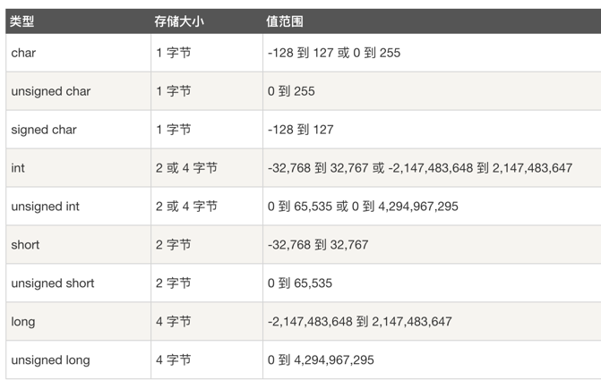

# rock-c

### 问题列表
* 4、sizeof函数的作用
* 7、exit(1)作用
* 8、memset（）作用啥
* 13、为什么说C的程序相对其他高级语言执行更快呢
* 14、C的内存管理
* 15、学习新的好的项目

# QA
### 0、C的优缺点
C是面向过程编程，语法简洁  
Ｃ语言中即使是再微小的事情都有安全隐患。它不是用来编写大型的商业软件的。  
初衷是为了让编译器和库的编写者可充分利用计算机每一个bit的计算能力  
系统级编程、嵌入式系统和驱动程序等领域--底层领域  
C语言的源代码可以直接转化为机器码，而其他语言的源代码则需要经过编译、解释等环节才能转化为机器码。这使得C语言在需要高效率的场景中更为适用  
### 1、C的数据类型

### 2、typedef unsigned char  __uint8_t 作用？
typedef为C语言的关键字  
作用是为一种数据类型定义一个新名字。  
这里的数据类型包括内部数据类型（int,char等）和自定义数据类型（struct等）  

### 3、#define作用
#define 定义一个标识符来表示一个常量。  
其特点是定义的标识符不占内存，只是一个临时的符号，预编译后这个符号就不存在了（使用的地方在预编译的时候会直接替换成对应常量值，所以说符号就不存在了）。  
用 #define 定义标识符的一般形式为：  
#define 标识符 常量 //注意, 最后没有分号  
#define 和 #include 一样，也是以“#”开头的。凡是以“#”开头的均为预处理指令，#define也不例外。  

### 4、C中头文件的作用和保存什么内容
C 函数声明和宏定义，被多个源文件中引用共享。有两种类型的头文件：程序员编写的头文件和编译器自带的头文件。  
在程序中要使用头文件，需要使用 C 预处理指令 #include 来引用它，在预处理阶段，会把引用的头文件内容复制到源文件中  
建议把所有的常量、宏、系统全局变量和函数原型写在头文件中，在需要的时候随时引用这些头文件。  
#include <file> 这种形式用于引用系统头文件。它在系统目录的标准列表中搜索名为 file 的文件  
#include "file" 这种形式用于引用用户头文件。它在包含当前文件的目录中搜索名为 file 的文件  

### 5、输入输出
scanf() 函数用于从标准输入（键盘）读取并格式化， printf() 函数发送格式化输出到标准输出（屏幕）。  

### 6、C中字符串如何表示
在 C 语言中，字符串实际上是使用空字符 \0 结尾的一维字符数组。因此，\0 是用于标记字符串的结束。
char arr[]={'x','b'};  char site[] = "RUNOOB";  

### 7、指针如何来操作
& 运算符访问的地址。指针类型必须与变量类型一致。  
指针中对应的值存的是变量的地址，%p取的是指针的值（及存的变量的地址信息）  
想取指针存的地址对应的值信息，使用*p  

### 8、判断逻辑
switch 语句中的 expression 是一个常量表达式，必须是一个整型或枚举类型。  
goto用法
`goto labelname;  
..  
.  
labelname: statement;`

### 9、C程序从创建到执行流程
在完成 .c 或 .cpp 文件的编写后，我们通常直接 gcc 或 g++ 后接文件名，就可以在当前文件夹下生成 a.out 可执行文件, 之后输入 ./a.out 即可执行该二进制可执行文件。  
gcc命令后面不加选项的话，就会默认执行预处理、编译、汇编、链接所有步骤，若程序没有错误的话，我们就可以得到一个可执行文件，默认为 a.out。  
  
-E选项：编译器执行完预处理阶段就停止执行，后面的编译、汇编等操作就不会执行。  
-S选项：编译器执行完编译阶段就会停止。  
-c选项：编译器执行完汇编阶段就会停止。  
详情：
- 1、编写.c文件
- 2、预处理  
    对于使用#例如#define 和#include的会把对应的常量或者头文件替换成具体内容
- 3、编译（将文件编译成汇编语言）
- 4、汇编（将汇编代码变成机器码，生成目标文件 .o (windows下为 .obj ) ）
- 5、链接（生成可执行文件 win中是exe程序，Linux中是.out可执行程序）

### 10、C源文件中引入的头文件中的函数，如何找到函数实现的
函数的声明放到头文件（.h文件）中，使用函数时引入对应的头文件就可以，编译器会在链接阶段找到函数体。  
链接会将前面编译好的.o文件、系统库的.o文件和库文件彼此相连接，有默认库文件加载路径，也可以指定库文件加载路径，指明从哪些库文件来链接  
如果是用gcc，那就需要用参数（-l -L）去指定这些库的名字及路径  

> 源文件编译后成生了目标文件（.o或.obj文件），目标文件中，这些函数和变量就视作一个个符号。  
> 在link的时候，需要在makefile里面说明需要连接哪个.o或.obj文件（在这里是b.cpp生成的.o或.obj文件），  
> 此时，连接器会去这个.o或.obj文件中找在b.cpp中实现的函数，再把他们build到makefile中指定的那个可以执行文件中。  
> 在VC中，一帮情况下不需要自己写makefile，只需要将需要的文件都包括在project中，VC会自动帮你把makefile写好。

### 11、一个C中如何引用另外一个C的实现的逻辑
在C中通过引用其的.h文件来使用其对应的函数实现。之后再把对应的lib包含进项目中。  
引入第三方包的方式  
1. 直接引入三方包实现的源文件--及直接在项目中添加三方的.c文件
2. gcc 会分别编译 main.c 和 sum.c（三方源文件），最后再把他们链接起来构成最终的 main 程序。--gcc main.c ./thirdparty/sum.c -o main
3. 引入头文件和静态库
  目标文件（Object，.o 结尾）是由源文件（.c、.cpp）编译但还未链接得到的二进制文件，目标文件此时已完成为了编译流程（预处理 -> 编译 -> 组装 -> 链接）中的前三步。  
  那什么又是静态库呢，怎样获得静态库呢？  
  静态库是由多个目标文件打包到一起得到的二进制文件，命名约定俗成以 lib 开头，中间是库名，然后是 .a 结尾，形如：libNAME.a  
    + 编译成目标文件 gcc -c ./thirdparty/sum.c -o sum.o  
    + sum.o 打包到静态库中，这里需要用到一个命令 ar（archive 的缩写  
  参数：-r replace 如果静态库中目标文件已存在，则替换为最新的。  
  -c 如果静态库不存在，在创建的时候不用弹出警告提示。  
  ar -rc libsum.a sum.o xxx.o 多个目标文件打入到libsum.a静态库中。  
  查看静态库中目标文件列表可以用 ar -t libsum.a
    + 把 main.c 和 上一步输出的静态库 libsum.a 合在一起编译出最终的可执行程序。  
     gcc main.c libsum.a -o main  
4. 引入头文件和动态链接库
   把常用的一些函数功能都封装到了这些共享库（Shared Object，后缀 .so）中。  
   在编译程序时共享库的内容并不打包到最终的可执行程序中，而是在程序执行时动态链接调用，因此这些共享库通常也被称之为动态链接库，程序运行时会自动到 /lib 和 /usr/lib 等库目录去搜索，当然你也可以指定一个自己的库目录。  
   构建自己的动态链接库 ：gcc -shared ./thirdparty/sum.c -o libsum.so  
   接着去生成 main.c 的可执行程序：gcc main.c -o main -L. -lsum -Wl,-rpath=.
   > -L. 指定编译时自定义的链接库目录，. 代表当前目录。  
   > -lsum 指定要动态链接的库，只需写名字，系统会自动加前后缀，即：libsum.so  
   > -Wl,-rpath=. 首先 -Wl,<option> 是传递选项给链接器，选项之间用 , 号分隔，-rpath=. 这个选项设置了程序运行时自定义库的目录为当前目录。  

