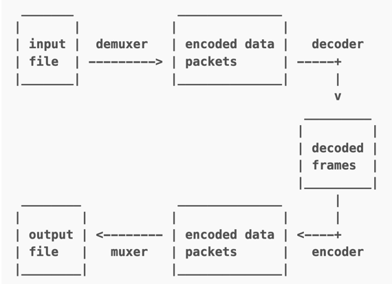

### FFmpeg
FFmpeg是一个跨平台的音视频处理库，以C语言编写。它支持几乎所有的音频和视频格式，并且可以进行转码、剪辑、过滤和流媒体等操作。

#### 音频相关概念介绍
* 模拟信号到数字信号的转换过程（连续 ->离散、不连续的过程才能被计算机使用
* 模拟信号->采样->量化->编码->数字信号
* 量化的基本概念： 采样大小：一个采样用多少个 bit 存放，常用的是 16bit
* 采样率：也就是采样频率(1秒采样次数)，一般采样率有 8kHz、16kHz、32kHz、44.1kHz、48kHz 等，采样频率越高，声音的还原就越真实越自然，当然数据量就越大
* 声道数：为了播放声音时能够还原真实的声场，在录制声音时在前后左右几个不同的方位同时获取声音，每个方位的声音就是一个声道。声道数是声音录制时的音源数量或回放时相应的扬声器数量，有单声道、双声道、多声道
* 码率：也叫比特率，是指每秒传送的bit数。单位为 bps(Bit Per Second)，比特率越高，每秒传送数据就越多，音质就越好。

模拟信号：时间连续，幅值连续。---比如太阳升起过程时间和位置都是连续的。但在计算机中我们不可能保存所有的时间点的位置，也不现实。
数字信号：时间离散，幅值离散。---我们只保存部分数据，比如每隔几分钟记录一个时间和位置，不连续，离散。

码率计算公式：
码率 = 采样率 * 采样大小 * 声道数
比如采样率44.1kHz，采样大小为16bit，双声道PCM编码的WAV文件：
码率=44.1hHz*16bit*2=1411.2kbit/s。
录制1分钟的音乐的大小为(1411.2 * 1000 * 60) / 8 / 1024 / 1024 = 10.09M。

#### 项目介绍
* libavcodec 提供一系列编码器的实现
* libavformat 实现在流协议，容器格式及其 IO 访问
* libavutil 包括了 hash 器、解码器和各种工具函数
* libavfilter 提供了各种音视频过滤器
* libavdevice 提供了访问捕获设备和回放设备的接口
* libswresample 实现了混音和重采样
* libswscale 实现了色彩转换和缩放功能

#### 安装步骤
按照项目中介绍的安装步骤进行安装，使用
./configure --prefix=/Users/opayc/c_file/ffmpeg --enable-gpl --enable-nonfree --enable-libfdk-aac 
--enable-libx264 --enable-libx265 --enable-filter=delogo --enable-debug --disable-optimizations 
--enable-libspeex --enable-videotoolbox --enable-pthreads --enable-version3 --enable-hardcoded-tables 
--cc=clang --host-cflags= --host-ldflags=

**tip:**
- 1、去掉：--enable-shared，会生成静态库
- 2、--prefix=是设置安装地址
- 3、在这个指定的路径下，会包含include和lib中包含静态资源
- 4、./configure 是生成makefile文件，make进行编译，make install进行链接安装

------------------------------------------------------------
#### ffmpeg API学习
    涉及到接口API的学习，音视频操作大体流程

------------------------------------------------------------
ffmpeg API
#### ffmpeg大体工作流程？
1. 读取输入源
2. 进行音视频的解封装
3. 解码每一帧音视频数据
4. ----处理解码后的音视频数据
5. 编码每一帧音视频数据
6. 进行音视频的重新封装
7. 输出到目标
常用功能：视频转码、提取音频、截取视频、裁剪画面、旋转画面、添加水印、添加字幕、合并视频、

------------------------------------------------------------
#### 转码过程

在解码和编码之间可以添加过滤功能（滤镜）