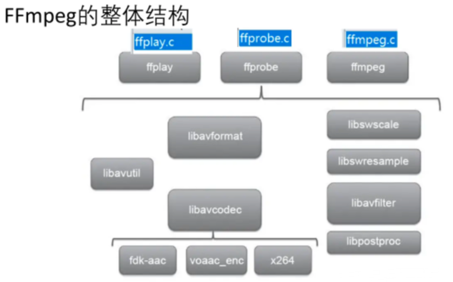
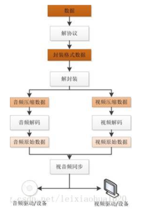
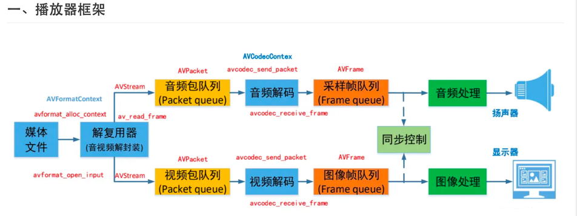

### FFmpeg
FFmpeg是一个跨平台的音视频处理库，以C语言编写。它支持几乎所有的音频和视频格式，并且可以进行转码、剪辑、过滤和流媒体等操作。

#### 音频相关概念介绍
* 模拟信号到数字信号的转换过程（连续 ->离散、不连续的过程才能被计算机使用
* 模拟信号->采样->量化->编码->数字信号
* 量化的基本概念： 采样大小：一个采样用多少个 bit 存放，常用的是 16bit
* 采样率：也就是采样频率(1秒采样次数)，一般采样率有 8kHz、16kHz、32kHz、44.1kHz、48kHz 等，采样频率越高，声音的还原就越真实越自然，当然数据量就越大
* 声道数：为了播放声音时能够还原真实的声场，在录制声音时在前后左右几个不同的方位同时获取声音，每个方位的声音就是一个声道。声道数是声音录制时的音源数量或回放时相应的扬声器数量，有单声道、双声道、多声道
* 码率：也叫比特率，是指每秒传送的bit数。单位为 bps(Bit Per Second)，比特率越高，每秒传送数据就越多，音质就越好。

模拟信号：时间连续，幅值连续。---比如太阳升起过程时间和位置都是连续的。但在计算机中我们不可能保存所有的时间点的位置，也不现实。
数字信号：时间离散，幅值离散。---我们只保存部分数据，比如每隔几分钟记录一个时间和位置，不连续，离散。

码率计算公式：
码率 = 采样率 * 采样大小 * 声道数
比如采样率44.1kHz，采样大小为16bit，双声道PCM编码的WAV文件：
码率=44.1kHz*16bit*2=1411.2kbit/s。
录制1分钟的音乐的大小为(1411.2 * 1000 * 60) / 8 / 1024 / 1024 = 10.09M。

视音频如果采用源数据进行保存会很大，录制一个音乐1分钟就10M，如果视视频会更大，因此需要采用视音频编。

============编码技术============
视音频技术主要包含以下几点：封装技术+视频压缩编码技术+音频压缩编码技术+流媒体协议技术（考虑到网络传输的话）
解码是整个系统中最重要也是最复杂的一个环节。

【】封装格式
avi，rmvb，mp4，flv，mkv等等，代表不同的封装格式（就是把视频数据和音频数据打包成一个文件的规范）

【】视音频编码标准
音频的压缩编码标准包含AAC（各个领域新），MP3（各个领域旧），AC-3（电影）等等。
视频的压缩编码标准则包含H.264（主流），MPEG2，VC-1等等。
H.264仅仅是一个编码标准，有多个实现。--x264其1，性能强悍.

【】解码之后--源数据
压缩编码的视频数据输出成为非压缩的颜色数据，例如YUV420P，RGB等等；
压缩编码的音频数据输出成为非压缩的音频抽样数据，例如PCM数据。

【】视频播放器的原理
视频播放器播放一个互联网上的视频文件，需要经过以下几个步骤：解协议（网络传输协议---具体视频封装格式数据），解封装，解码视音频，视音频同步。
如果播放本地文件则不需要解协议，为以下几个步骤：解封装（把封装格式---视音频压缩数据码流），解码视音频（视音频压缩数据码流--视音频解码---视音频原始数据），
视音频同步（同步解码出来的视频和音频数据，并将视频音频数据送至系统的显卡和声卡播放出来）。

#### 项目介绍
* libavcodec 提供一系列编码器的实现
* libavformat 实现在流协议，容器格式及其 IO 访问
* libavutil 包括了 hash 器、解码器和各种工具函数
* libavfilter 提供了各种音视频过滤器，音频特效和视频特效的处理
* libavdevice 提供了访问捕获设备和回放设备的接口
* libswresample 实现了混音和重采样
* libswscale 实现了色彩转换和缩放功能
ffmpeg整体项目结构

#### 安装步骤
按照项目中介绍的安装步骤进行安装，使用
./configure --prefix=/Users/opayc/c_file/ffmpeg --enable-gpl --enable-nonfree --enable-libfdk-aac 
--enable-libx264 --enable-libx265 --enable-filter=delogo --enable-debug --disable-optimizations 
--enable-libspeex --enable-videotoolbox --enable-pthreads --enable-version3 --enable-hardcoded-tables 
--cc=clang --host-cflags= --host-ldflags=

**tip:**
- 1、去掉：--enable-shared，会生成静态库
- 2、--prefix=是设置安装地址
- 3、在这个指定的路径下，会包含include和lib中包含静态资源
- 4、./configure 是生成makefile文件，make进行编译，make install进行链接安装

**在Mac中安装ffmpeg的方式**
- 1、使用像Homebrew或MacPorts这样的包管理器来安装ffmpeg。这些将自动使您的FFmpeg安装保持最新。
- 2、下载源代码，然后运行带有所需标志的。/configure, make和make install。但是，必须手动设置配置选项，并且您需要自己安装第三方库。

------------------------------------------------------------
#### ffmpeg API学习
    涉及到接口API的学习，音视频操作大体流程
    C中输出到文件？？

------------------------------------------------------------
ffmpeg API
#### ffmpeg大体工作流程？
1. 读取输入源
2. 进行音视频的解封装
3. 解码每一帧音视频数据
4. ----处理解码后的音视频数据
5. 编码每一帧音视频数据
6. 进行音视频的重新封装
7. 输出到目标
常用功能：视频转码、提取音频、截取视频、裁剪画面、旋转画面、添加水印、添加字幕、合并视频、

【】API解释
avformat_alloc_context();负责申请一个AVFormatContext结构的内存,并进行简单初始化
avformat_free_context();释放该结构里的所有东西以及该结构本身
avformat_close_input();关闭解复用器。关闭后就不再需要使用avformat_free_context 进行释放。
avformat_open_input();打开输入视频文件
avformat_find_stream_info()：获取音视频文件信息
av_read_frame(); 读取音视频包-
详解：
    av_read_frame()的作用是读取码流中的音频若干帧或者视频一帧。例如，解码视频的时候，每解码一个视频帧，
    需要先调 用 av_read_frame()获得一帧视频的压缩数据，然后才能对该数据进行解码（例如H.264中一帧压缩数据通常对应一NAL）
avformat_seek_file(); 定位文件
av_seek_frame():定位文件

流程：
1、分配解复用器上下文avformat_alloc_context
2、根据URL或者网络流打开音视频文件avformat_open_input
3、读取数据包获取码流信息avformat_find_stream_info
4、循环：读取数据包av_read_frame或定位文件avformat_seek_file+av_seek_frame
5、关闭解复用器avformat_close_input

解码器相关
avcodec_alloc_context3(): 分配解码器上下文 1
avcodec_find_decoder()：根据ID查找解码器
avcodec_find_decoder_by_name():根据解码器名字
avcodec_open2()： 打开编解码器
avcodec_decode_video2()：解码一帧视频数据
avcodec_decode_audio4()：解码一帧音频数据
avcodec_send_packet(): 发送编码数据包
avcodec_receive_frame(): 接收解码后数据
avcodec_free_context():释放解码器上下文，包含了avcodec_close()
avcodec_close():关闭解码器

FFmpeg提供了两组函数，分别⽤于编码和解码：
解码：avcodec_send_packet()、avcodec_receive_frame()。
编码：avcodec_send_frame()、avcodec_receive_packet()。
流程：
1、分配编解码器上下文avcodec_alloc_context3
2、降码流中的编解码信息拷贝到AVCodecContext中
3、根据编解码信息找到对应编解码器avcodec_find_decoder+avcodec_find_decoder_by_name
4、打开编解码器avcodec_open2并关联到AVCodecContext
5、循环：1、向解码器发送数据包avcodec_send_packet 2、接收解码后数据avcodec_receive_frame
6、关闭解码器avcodec_close和释放上下文avcodec_free_context

关键参数解释
1. AVFormatContext 封装格式上下文结构体，也是统领全局的结构体，保存了视频文件封装格式相关信息。
2. AVInputFormat demuxer 每种封装格式（例如FLV, MKV, MP4, AVI）对应一个该结构体。
3. AVOutputFormat muxer
4. AVStream 视频文件中每个视频（音频）流对应一个该结构体。
5. AVCodecContext 编解码器上下文结构体，保存了视频（音频）编解码相关信息。
6. AVCodec 每种视频（音频）编解码器(例如H.264解码器)对应一个该结构体。
7. AVPacket 存储一帧压缩编码数据。
8. AVFrame 存储一帧解码后像素（采样）数据。

AVPacket--解码--AVFrame--编码--AVPacket

每个AVStream对应一个AVCodecContext，每个AVCodecContext对应一个AVCodec(AVCodecContext是一个描述编解码器上下文的数据结构，
包含了众多编解码器需要的参数信息，AVCodec包含该视频/音频对应的解码器，每个解码器都对应一个AVCodec结构，且在编译时确定)
AVStream--AVCodecContext--AVCodec

- 数据结构分析
1、AVFormatContext
AVIOContext *pb：输入数据的缓存
unsigned int nb_streams：视音频流的个数
AVStream **streams：视音频流-输入媒体的AVStream []数组
char filename[1024]：文件名
int64_t duration：时长（单位：微秒us，转换为秒需要除以1000000）
int bit_rate：比特率（单位bps，转换为kbps需要除以1000）
AVDictionary *metadata：元数据

2、AVInputFormat
name：封装格式名称
extensions：封装格式的扩展名
id：封装格式ID
一些封装格式处理的接口函数,比如read_packet()

3、AVStream
index：标识该视频/音频流
time_base：该流的时基，PTS*time_base=真正的时间（秒）
avg_frame_rate： 该流的帧率
duration：该视频/音频流长度
codecpar：编解码器参数属性

4、AVCodecParameters
codec_type：媒体类型，比如AVMEDIA_TYPE_VIDEO AVMEDIA_TYPE_AUDIO等
codec_id：编解码器类型， 比如AV_CODEC_ID_H264 AV_CODEC_ID_AAC等。

5、AVCodecContext
codec：编解码器的AVCodec，比如指向AVCodec ff_aac_latm_decoder
width, height：图像的宽高（只针对视频）
pix_fmt：像素格式（只针对视频）
sample_rate：采样率（只针对音频）
channels：声道数（只针对音频）
sample_fmt：采样格式（只针对音频）

6、AVCodec
const char *name：编解码器的名字，比较短
const char *long_name：编解码器的名字，全称，比较长
enum AVMediaType type：指明了类型，是视频，音频，还是字幕
enum AVCodecID id：ID，不重复
const AVRational *supported_framerates：支持的帧率（仅视频）
const enum AVPixelFormat *pix_fmts：支持的像素格式（仅视频）
const int *supported_samplerates：支持的采样率（仅音频）
const enum AVSampleFormat *sample_fmts：支持的采样格式（仅音频）
const uint64_t *channel_layouts：支持的声道数（仅音频）
int priv_data_size：私有数据的大小

7、AVCodecContext
codec：编解码器的AVCodec，比如指向AVCodec ff_aac_latm_decoder
width, height：图像的宽高（只针对视频）
pix_fmt：像素格式（只针对视频）
sample_rate：采样率（只针对音频）
channels：声道数（只针对音频）
sample_fmt：采样格式（只针对音频）

8、AVCodec
name：编解码器名称
type：编解码器类型
id：编解码器ID
一些编解码的接口函数，比如int (*decode)()

9、AVPacket(核心类)--解码前数据，AVPacket是存储压缩编码数据相关信息的结构体
pts：显示时间戳
dts：解码时间戳
data：压缩编码数据
size：压缩编码数据大小
pos:数据的偏移地址
stream_index：流id，可以通过id来区分是视频流、音频流、字幕流--0表示Video，1表示Audio ，
flag: 描述该packet的属性，比如该packet的内容损坏/需要放弃等
duration:该packet的播放持续时间，和pts/dts的单位一样。
比如duration=40,AVStream->time_base=0.001秒，则该packet的duration=40*0.001=0.04秒。
通常duration=下一个packet的pts - 当前packet的pts。

10、AVFrame--解码后数据
uint8_t *data：解码后原始数据（对视频来说是YUV，RGB，对音频来说是PCM）
int linesize：data中“一行”数据的大小。注意：未必等于图像的宽，一般大于图像的宽。
int width, height：视频帧宽和高（1920x1080,1280x720...）
int nb_samples：音频的一个AVFrame中可能包含多个音频帧，在此标记包含了几个
int format：解码后原始数据类型（YUV420，YUV422，RGB24...）
int key_frame：是否是关键帧
enum AVPictureType pict_type：帧类型（I,B,P...）
AVRational sample_aspect_ratio：宽高比（16:9，4:3...）
int64_t pts：显示时间戳
int coded_picture_number：编码帧序号
int display_picture_number：显示帧序号
int8_t *qscale_table：QP表
uint8_t *mbskip_table：跳过宏块表
int16_t (*motion_val)：运动矢量表
uint32_t *mb_type：宏块类型表
short *dct_coeff：DCT系数，这个没有提取过
int8_t *ref_index：运动估计参考帧列表（貌似H.264这种比较新的标准才会涉及到多参考帧）
int interlaced_frame：是否是隔行扫描

解释
AVFrame结构体一般用于存储原始数据（即非压缩数据，例如对视频来说是YUV，RGB，对音频来说是PCM），此外还包含了一些相关的信息。
比如说，解码的时候存储了宏块类型表，QP表，运动矢量表等数据。
------------------------------------------------------------
#### 转码过程
  
在解码和编码之间可以添加过滤功能（滤镜）
视频编解码器：图像数据---H256解码/编码器---H256帧
音频编解码器：声音数据---AAC解码/编码器---AAC帧

#### 播放器框架

