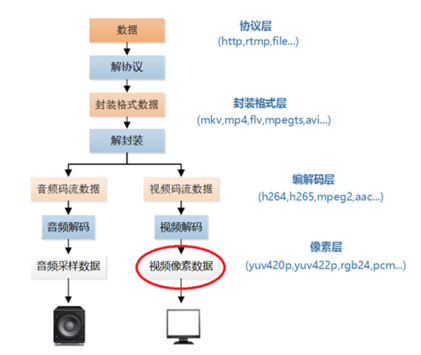

视频像素数据在视频播放器的解码流程中的位置

流程部分-使用 **普通的方式（未使用ffmpeg）** 分别对应各个部分的处理  
1、解协议（网络协议）--protocol_check.c  
2、解封装（mkv等）--package_check.c  
3、解码（把h256，aac等视音频压缩格式解压）--xxx_coding_check.c  
4、视音频像素源数据（yuv420p,pcm，rgb等）--xxx_source_check.c   

解码（视音频）+编码（视音频）+特效

源文件格式
1. YUV是什么？
   YUV是视频、图片、相机等应用中使用的一类图像格式，实际上是所有“YUV”像素格式共有的颜色空间的名称。
   与RGB格式（红 – 绿 – 蓝）不同，YUV是用一个称为Y（相当于灰度）的“亮度”分量和两个“色度”分量表示，
   分别称为U（蓝色投影）和V（红色投影），由此得名。
   Y表示亮度分量：如果只显示Y的话，图像看起来会是一张黑白照。
   U（Cb）表示色度分量：是照片蓝色部分去掉亮度（Y）。
   V（Cr）表示色度分量：是照片红色部分去掉亮度（Y）。
2. RGB是什么？
   RGB色彩模式是工业界的一种颜色标准，是通过对红（R）、绿（G）、蓝（B）三个颜色通道的变化以及它们相互之间的叠加来得到各式各样的颜色的，
   RGB即是代表红、绿、蓝三个通道的颜色，这个标准几乎包括了人类视力所能感知的所有颜色，是运用最广的颜色系统之一。
3. PCM是什么？
   脉冲编码调制（Pulse Code Modulation），简称PCM。
   脉码调制：是对连续变化的模拟信号进行处理、量化、编码后转换为数字信号的一种调制方式。
   人耳听到的声音是模拟信号，PCM就是要把声音从模拟转换成数字信号的一种技术，
   他的原理简单地说就是利用一个固定的频率对模拟信号进行采样，采样后的信号在波形上看就像一串连续的幅值不一的脉冲，
   把这些脉冲的幅值按一定的精度进行量化，这些量化后的数值被连续地输出、传输、处理或记录到存储介质中，
   所有这些组成了数字音频的产生过程。

### 【】像素数据的分析

# include <string.h>
void *memset(void *s, int c, unsigned long n);
函数的功能是：将指针变量 s 所指向的前 n 字节的内存单元用一个“整数” c 替换
作用是将某一块内存中的内容全部设置为指定的值， 这个函数通常为新申请的内存做初始化工作  
2. 【】fwrite和fread作用？
对参数的说明：
  ptr 为内存区块的指针，它可以是数组、变量、结构体等。fread() 中的 ptr 用来存放读取到的数据，fwrite() 中的 ptr 用来存放要写入的数据。
  size：表示每个数据块的字节数。
  count：表示要读写的数据块的块数。
  fp：表示文件指针。
  理论上，每次读写 size*count 个字节的数据。

返回值：返回成功读写的块数，也即 count。如果返回值小于 count：
对于 fwrite() 来说，肯定发生了写入错误，可以用 ferror() 函数检测。
对于 fread() 来说，可能读到了文件末尾，可能发生了错误，可以用 ferror() 或 feof() 检测。

6. feof作用是什么？
   feof是C语言标准库函数，其原型在stdio.h中，其功能是检测流上的文件结束符，
   如果文件结束，则返回非0值，否则返回0（即，文件结束：返回非0值；文件未结束：返回0值）。
7. memcpy()作用
   memcpy()--<string.h>
   void *memcpy(void *str1, const void *str2, size_t n) 从存储区 str2 复制 n 个字节到存储区 str1
8. fseek作用
   int fseek(FILE *stream, long offset, int origin);
   stream : 待移动的FILE型指针变量
   offset：偏移量，每次移动多少个字节
   origin: 指针开始的位置
   fseek函数功能是将文件指针移动到指定的地方，因此可以通过fseek重置文件指针的位置。 
   返回值： 如果fseek ()返回值为0，表示执行成功，如果返回值为非0， 则执行失败。
9. rewind
   是C 程序中的库函数。 功能: 将文件内部的位置指针重新指向一个流(数据流/文件)的开头。
10. 字符所占字节大小
    char与unsigned char没有什么不同，都是一个字节，唯一的区别是，char的最高位为符号位，因此char能表示-128~127,unsigned char没有符号位，因此能表示0~255

